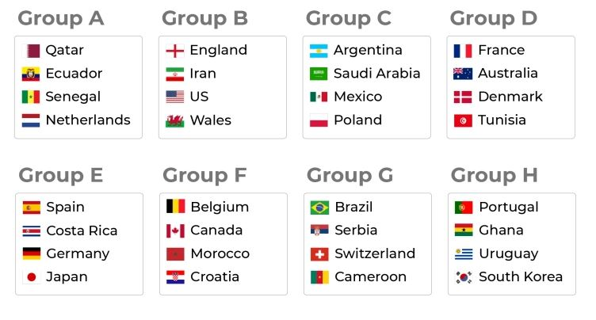

# Markdown Code Here
<!--Markdown Comment-->

#### Table Of Content:
1. [Heading](#link1)
1. [Paragraph](#link2)
1. [In-line/Multi-Line Code](#link3)
1. [List](#link4)
1. [Link](#link5)
1. [image](#link6)
1. [Table](#link7)
1. [Button](#link8)

#### Line Break:
Hi!<br/>
I am Mahadeb Kumar das.  
I am a student.  
I am graduated from European University Of Bangladesh.

#### Horizontal Rule:
Mahadeb Kumar Das
___


<a name="link1"></a>
#### Heading Tag: 
# H1
## H2
### H3
#### H4
##### H5
###### H6

#### Italic:
_Mahadeb Kumar Das_

*Mahadeb Kumar Das*

#### Bold:
**Mahadeb Kumar Das**

__Mahadeb Kumar Das__

Mahadeb __Kumar__ Das

#### Bold & Italic:
**_Mahadeb Kumar Das_**<br/>
_**Mahadeb Kumar Das**_<br/>
***Mahadeb Kumar Das***  
___Mahadeb Kumar Das___


<a name="link2"></a>
#### Paragraph:
<p>Lorem ipsum dolor sit amet, consectetur adipisicing elit. Dolorem odit architecto</p><p>possimus nesciunt modi deserunt eius voluptatibus facilis alias placeat?</p>Mahadeb Kumar Das

#### Underline:
<u>Lorem ipsum dolor sit amet, consectetur adipisicing elit. Dolorem odit architecto</u>


<a name="link3"></a>
#### In-line code block:
`<h1>Lorem</h1><p>Lorem ipsum dolor sit amet, consectetur adipisicing elit. Dolorem odit architecto</p>`

#### Multiple code block:
```html
<html>
<head>
    <title>

    </title>
</head>
<body>

</body>
</html>
```
#### Quote:
>First Line
>>Second Line
>>>Third Line
>>>>Fourth Line

>>Fifth Line


<a name="link4"></a>
#### List:
###### Ordered List:
1. Item 1
2. Item 2
   1. Item 2.1
      1. Item 2.1.1
      1. Item 2.1.2
   1. Item 2.2
   1. Item 2.3
3. Item 3
4. Item 4
   1. Item 4.1

###### Unordered List:
* Item 1
+ Item 2
   - Item 2.1
   - Item 2.2
     - Item 2.2.1
     - Item 2.2.2
   - Item 2.3
+ Item 3
+ Item 4
   - Item 4.1


<a name="link5"></a>
#### Link:
https://www.facebook.com

[Facebook Link](https://www.facebook.com)

[Facebook Link](https://www.facebook.com "Facebook")

It is a [youtube] link

[youtube]:https://www.facebook.com "Click here"


<a name="link6"></a>
#### Image Syntax:


  ##### Image link:
[](https://www.facebook.com)

  ##### Image Customize:
  <div align="center">
   
  </div>

<br/>

Mahadeb Kumar Das  
***
---
___

#### Emoji:
Smile 😉😁


<a name="link7"></a>
#### Table:
| Name | Email |
|------|--------|
|Mahadeb Kumar Das|mahadeb@email.com|
|Tushar Kanti Das|tushar@email.com|
|Mrinal Sarkar|mrinal@email.com|
|Mrinal Sarkar|mrinal@email.com|

#### Collapse:
<details>
  <summary>Collapse</summary>

  ## About Lorem
  Lorem ipsum dolor sit amet, consectetur adipisicing elit. Dolorem odit architecto</p><p>possimus nesciunt modi deserunt eius voluptatibus facilis alias placeat
</details>

#### CheckBox:
- [X] Checkbox 1
- [x] Checkbox 2
- [ ] Checkbox 3
- [x] Checkbox 4

<a name="link8"></a>
#### Keyboard Button:
To Select-> <kbd>Ctrl</kbd> + <kbd>A</kbd><br/>
To Save-> <kbd>Ctrl</kbd> + <kbd>S</kbd>

#### Badge:


#### Mention:
@das

